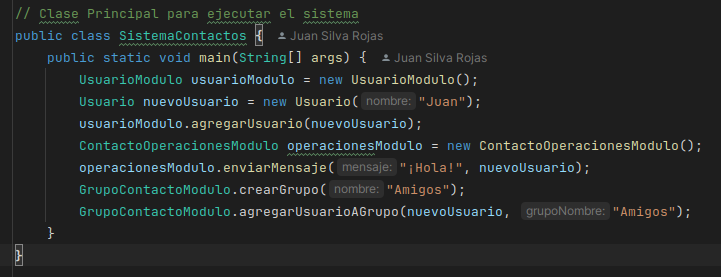

### Ejercicio: Análiza el Acoplamiento y realiza el cálculo del factor de acoplamiento (CF)  
  
### 1) CLASE USUARIO MODULO:  

#### 1.1) Hallando el aclopamiento eferente (Ce):  
-> En la creación de una lista se usa la el módulo `Usuario`  
-> Se usa el modulo `GrupoContactoModulo` para usar el método agregarUsuarioAGrupo  
  
Por lo tanto Ce = 2  
 
#### 1.2) Hallando el acoplamiento aferente (Ca):  
-> En la clase `SistemaContactos` se usa una instancia de la esta clase (UsuarioModulo)  
  
Por lo tanto Ca = 1  
  
### 2) CLASE GRUPO CONTACTO MODULO  

#### 2.1) Hallando el acoplamiento eferente (Ce):  
-> Se utiliza la módulo/clase `Usuario`  
  
Por lo tanto Ce = 1  
  
#### 2.2) Hallando el acoplamiento aferente (Ca):  
-> En la clase `SistemaContactos` se usa una instancia de la esta clase (UsuarioModulo)  
-> En el módulo `UsuarioModulo` se usa este módulo (GrupoContactoModulo)  
  
Por lo tanto Ca = 2  
  
### 3) CLASE CONTACTO OPERACIONES MODULO

#### 3.1) Hallando el aclopamiento eferente (Ce):  
-> En el método enviarMensaje utiliza un módulo externo `Usuario` como argumento  
  
Por lo tanto Ce = 1  
  
#### 3.2) Hallando el acoplamiento aferente (Ca):  
-> En la clase `SistemaContactos` se usa una instancia de la esta clase (ContactoOperacionesModulo)  
  
Por lo tanto Ca = 1  
  
### 4) CLASE USUARIO:

#### 3.1) Hallando el aclopamiento eferente (Ce):  
Esta clase no utiliza módulos externos  
  
Por lo tanto Ce = 0

#### 3.2) Hallando el acoplamiento aferente (Ca):  
-> Es utlizado en el módulo `UsuarioModulo`  
-> Es utlizado en el módulo `GrupoContactoModulo`   
-> Es utlizado en el módulo `ContactoOperacionesModulo`  
-> Es utlizado en el módulo `SistemaContacto`   
  
Por lo tanto Ca = 4  
  
### 5) CLASE SISTEMA CONTACTO

#### 5.1) Hallando el acomplamiento eferente (Ce):  
-> Se utiliza una instancia de la clase externa `UsuarioModulo`   
-> Se utiliza una instancia de la clase externa `Usuario`  
-> Se utiliza una instancia de la clase externa `ContactoOperacionesModulo`  
-> Se utiliza una instancia de la clase externa `GrupoContactoModulos`  
  
Por lo tanto Ce = 4  
  
#### 5.2) Hallando el acoplamiento aferente (Ca):
Ninguna clase/modulo externo utiliza este modulo  
  
Por lo tanto Ca = 0  
  
# Hallando el Factor de Acoplamiento(CF)  
El `CF = e / [a*(n-1)]`, para hallar el e veamos el siguiente gráfico:   

  

El e sería las conexiones entre modulos (flechas) entonces `e = 8`  
Para hallar el a y el n simplemente se cuentan el numero de modulos, entonces `a = n = 5`  
(En este caso n = a porque al haber un solo archivo .java no hay un sistema en si, cuando a es el número de modulos del sistema)  
Por lo tanto reemplazando el la fórmula tendriamos que `CF = 2/5`