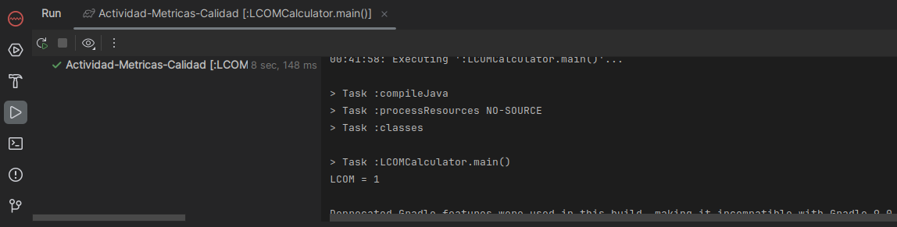

### Ejercicio 1: Extender LCOMCalculator para incluir más métodos y atributos  
En un principio ejecutando el código por defecto que se nos da, nos sale el LCON = 1  

  
  
Entonces procedemos a añadir 5 métodos mas a la clase `classInfo` como se muestra en la imágen:  

  
  
Luego al ejecutar el programa el LCOM varia aumentando hasta 10  

  

Esto evidentemente es no deseable en un caso real, pues un LCOM alto implica una baja cohesion.  

### Ejercicio 2: Refactorizar LCOMCalculator para mejorar la legibilidad y eficiencia  
  
Separamos la lógica para el cálculo del LCOM en un método aparte (`getLCOM`) como se muestra en la imágen:  

  
Además implementamos excepcion en el método `addMethod`para asegurar que los parámetros no sean vacíos:  
  
### Ejercicio 3:  Implementar unidades de pruebas para LCOMCalculator  
Implementamos test para comprobar si la funcion getLCOM está devolviendo el valor correcto, para este caso dado los métodos el LCOM esperado debe ser 1  
  
  

