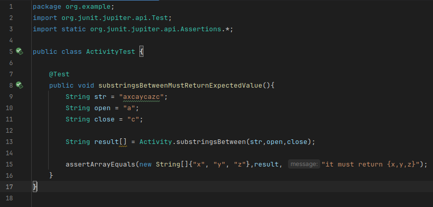

### Ejercicio 1: Escribe el código de prueba y considera las entradas str = "axcaycazc", open = "a" y close= "c" y explica lo que hace el código anterior.

El código proporcionado contiene una función `substringsBetween()` que 
que resive como parametro un arrelo y unos delimitadores `open` y `close`
y al final devuelve una subcadena que esté entre esos delimitadores.  
En el caso que la cadena sea nula o los delimitadores sean vacíos
devuelve un nulo dicha función.
En el caso que la cadena de entrada es vacia se devuelve una array vacío.  

#### Implementacion del test:
Para lo que se solicita `str = "axcaycazc"` debería devolver la
función `{"x","y","z"}` siempre y cuando la función esté bien
implementada:

#### Resultado:  
El test pasa satisfactoriamente:
  
  
### Ejercicio 2: Revisa los requisitos una vez más y escribe todos los casos de prueba que se te ocurran. El formato no importa, puede ser algo así como "todos los parámetros son nulos". Cuando hayas terminado con esta nota, compara tu conjunto de pruebas inicial con el que estamos a punto de derivar.  
##### Paso 1) Para el método substringsBetween():  

• El objetivo de este método es recopilar todas las subcadenas en una cadena que están
delimitadas por una etiqueta open y una etiqueta close (el usuario las proporciona).  

• El programa recibe tres parámetros:
- str, que representa la cadena de la que el programa extraerá las subcadenas
- La etiqueta open, que indica el inicio de una subcadena
- La etiqueta close, que indica el final de la subcadena
- El programa devuelve un arreglo compuesto por todas las subcadenas encontradas por el
programa.