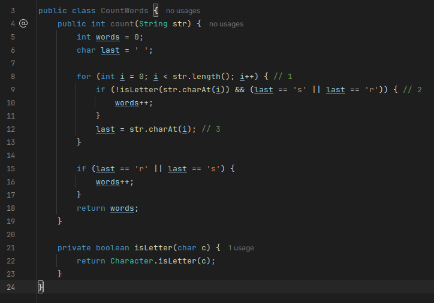
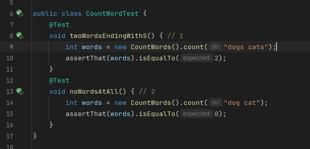
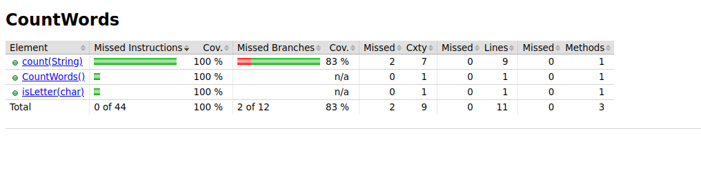
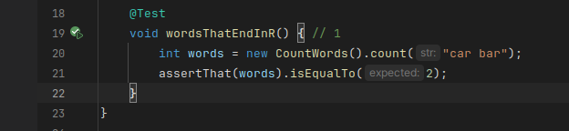
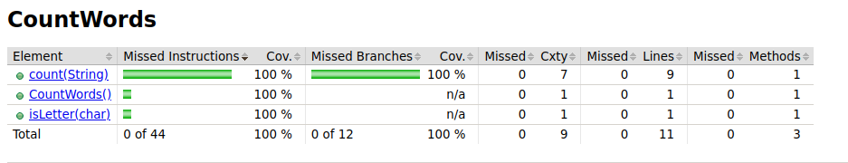

### Ejercicio 1: Explica qué hacen las líneas 1, 2 y 3 en el código  
    
La **linea 1** recorre cada caracter del String str  
La **linea 2** verifica si ya se llego a la ultima letra para ello usa la funcion isLetter, 
de tal forma que si no es una letra quiere decir que ya recorrimos toda la palabra entonces vemos si la letra previa(es decir la ultima letra) es una s o r  
La **linea 3** actualiza la variable last para que contenga el caracter actual, preparando así la comparación para la siguiente 
iteración del bucle. 

  
    
### Ejercicio 2: Explica qué hacen las líneas 1 y 2 del código. Presenta un informe generado por JaCoCo (www.jacoco.org/jacoco) u otra herramienta de cobertura de código de tu preferencia en el IDE del  curso.
La **linea 1** testea un caso en donde hay palabras que terminan en s  
La **linea 2** testea un caso en donde no hay ninguna palabra que termine en s o r
  
    
El reporte que se muestra en la imagen muestra que el número de instrucciones que no fueron ejecutadas es cero,
esto implica que  todas las instrucciones del código están cubiertas por las pruebas.Es bueno esto porque 
indica que cada línea de código fue ejecutada al menos una vez durante las pruebas.  
  
Sin embargo hay algunas ramas que no fueron ejecutadas (2 ramas) esto es que no todas
las condicionales fueron probadas.
  
  
### Ejercicio 3: Explica la línea 1 y con el caso de prueba recién agregado en el conjunto de pruebas, vuelve a ejecutar la herramienta de cobertura. Explica los cambios obtenidos.  
En la linea 1 de la imagen simplemente se añade un test del caso donde hay palabras que terminan en r.
  
    
Ahora al obtener el reporte vemos que se cubren todas las ramas (menciona que ninguna rama ha sido omitida)
esto es porque ahora probramos los casos cuando las palabras termianan en r.
  
  
### Ejercicio 4: Análisis del código y cobertura  
### Parte A: Análisis de código  
  
Preguntas:
#### 1. Explica qué hacen las líneas 1, 2 y 3 en el código.  
Explicado en el ejercicio 1.  

#### 2. ¿Qué sucedería si se eliminara la línea 3 del código?  
 Entonces la variable last siempre sera ' ' y nunca entrará a la condicional de la linea 9 y 15 y la
 varibable word sera 0, por lo tanto count retorna cero siempre.  

#### 3. Escribe una descripción de alto nivel de lo que hace este método count   
El método `count()` cuenta el número de palabras que terminan en r o s de una cadena que se pasa como argumento.
 
  
### Parte B: Pruebas Unitarias  
  

Preguntas:
#### 4. Explica qué hacen las líneas 1 y 2 del código de prueba.  
Explicado en el ejercicio 2.

#### 5. ¿Qué tipos de casos de prueba adicionales se deberían agregar para mejorar la cobertura?  
Se deberían agregar casos en donde haya un string que tengan palabras que termine en r.  
También casos de un string que tengan palabras que terminen tanto en r y s (ambos casos en un string).  
Casos en donde el String es una cadena vacía.  

