## Ejercicio 1: Modelo de árbol de Ataque  
Vamos a implementar el siguiente árbol de ataque  
  
  
Se crea primero los 3 primeros nodos de `virus infects a file`, `virus runas an administrator`, y `virus run as normal user`, con sus respectivos parametros, para luego concatenarlos de manera que los dos ultimos sean hijos del primero  

  
  
Para construir lo demás simplemente se crean los nodos individualmente (como en la linea 12 y 15) y luego se concatenan como hijos para sus respectivos nodos(linea 17 y 18)  
  
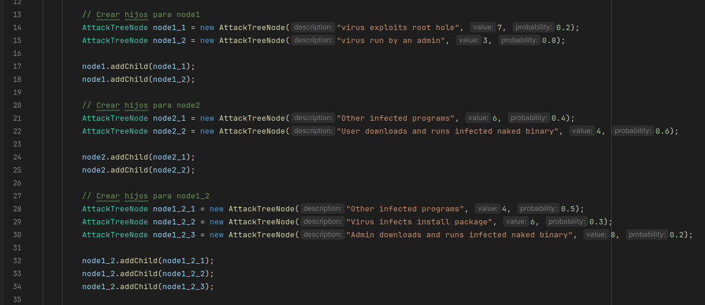  
  
con esto ya tendríamos los nodos contruidos donde cada nodo sabe cual es su padre e hijo, solo queda instanciarlo con la clase `AttackTree` y luego obtenemos el riesgo total  
  
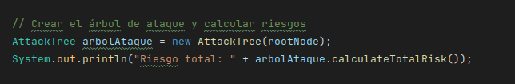  
  
Después procedemos a hallar el camino crítico como sigue:  
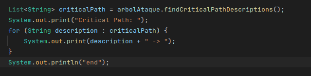  
  
Lo que imprime en consola es lo siguiente:  
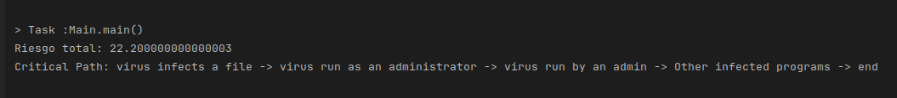  
 
### Analicemos los resultados:  
1) El resultado nos sale 22.20, esto es una medida que ayuda a saber si el sistema es seguro o no, en este caso sale un riego alto
es decir que con el árbol construido es posible vulnerar la seguridad del sistema.  
2) En cuanto al Camino critico gráficamente sería:  

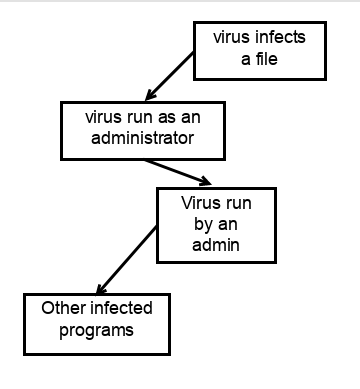  

Esto es un de los subarbol del árbol real, del cual justo ese contiene el mayor riesgo acumulado en comparación a los otros, por lo tanto muy probablemente en árbol de ataque tenga éxito por ese camino.  
  
  
## Ejercicio 2: Sistema de autenticación y autorización  
Para la implementacion creamos roles de Admininistrador y usuario y permisos que se pueden hacer en el sistema (en este caso editar y leer) y añadimos
esos respectivos permisos a cada rol como se muestra en la imagen
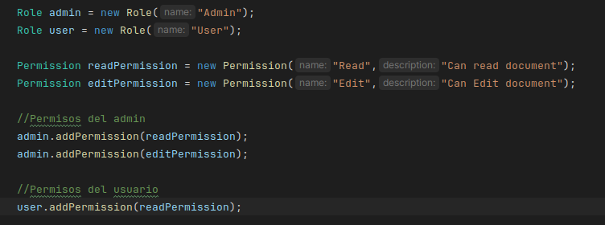  
  
Después creamos 3 usuarios de ejemplo y le añadimos roles respectivos:  
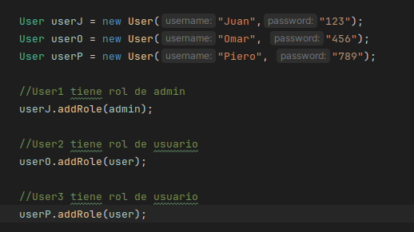  
  
Para emular la autenticacion usaremos la funcion `autenticate` donde devolverá `true` si el username y password son validos
y `false` si no lo son, la implementacion se muestra e la siguiente imagen:
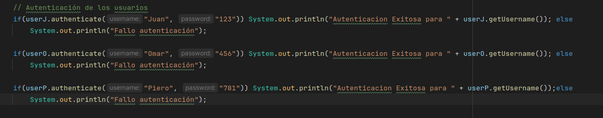  
  
Para emular los permisos usamos la función `hasPermission` donde se verificará si el permiso dado en su parámetro es realmente el permiso que posee el usuario
la implementacion de esto se sigue en la siguiente imagen:  

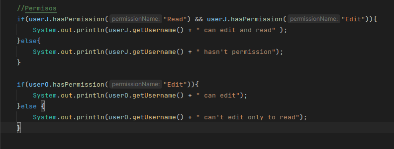  
  
## Ejercicio 3: Evaluación de seguridad persistente  
En la implementación se añaden 2 recuersos uno llammado `Database` y otro `File Server`, con sus 
respectivos nivel de sensibilidad, este ultimo es una medida que representa el impacto que tendría
vulnerar un recurso en específico, en este caso DataBase coviene protegerlo mas.  

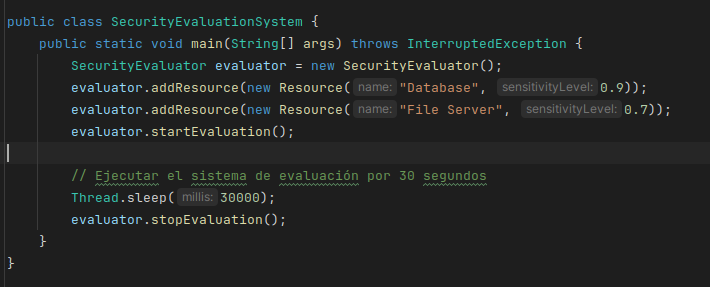  
  
De la imagen anterior la linea `evaluator.startEvaluation()` inicia un monitoreo de la seguridad de los 2 recursos,
como se ve el imagen de abajo se empieza a evaluar el riesgo cada 10 segundos (com `evaluateRisk()` que suma los niveles de sensisiblidad)
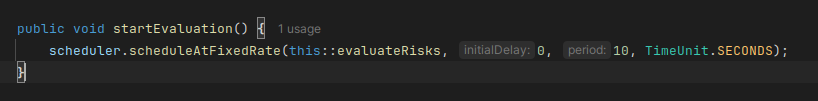  
  
### Analisis de los Resultados:  
En la salida en consola devuelve que siempre el riesgo total es `1.6` esto significa que los recursos y sus niveles de sensibilidad no han cambiado, y el sistema está funcionando correctamente (en esos 30 segundos)
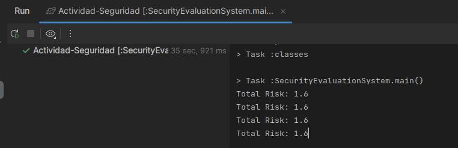  
  
Si por alguna razón el Riego total varia, por ejemplo aumenta entonces hay una mayor probabilidad que el sistema sea vulnerado por lo tanto esto ya es un indicativo que se requiere una mayor medida de proteccion
caso contrario si disminuye quiere decir que el sistema de seguridad esta funcionando efectivamenete.