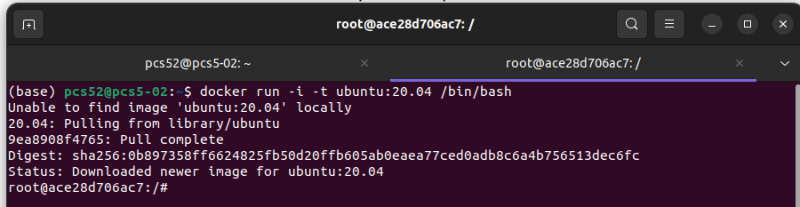
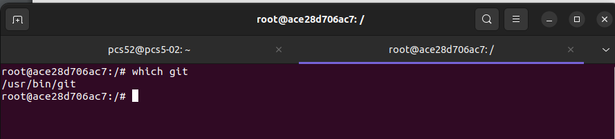
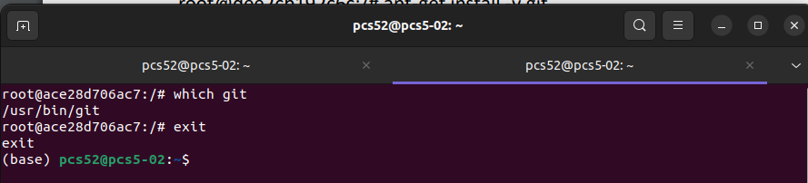
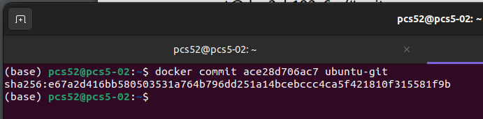
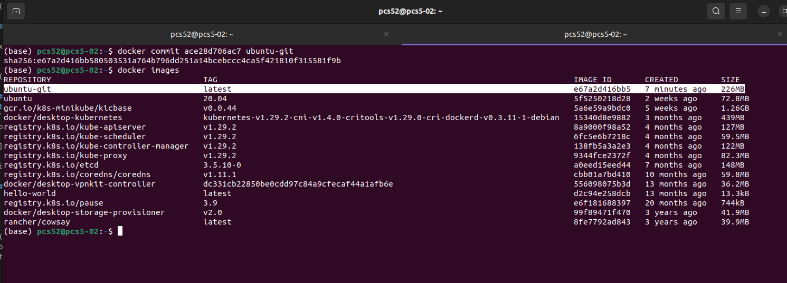

### Docker commit  
Comencemos con un ejemplo y preparemos una imagen con los kits de herramientas de Git y JDK. Usaremos Ubuntu 20.04 como imagen base. No hay necesidad de crearlo; la mayoría de las imágenes base están disponibles en el registro de Docker Hub. Procede de la siguiente  
  
#### 1. Ejecuta un contenedor desde ubuntu:20.04 y conéctalo a tu línea de comando, así:
 ```
 $ docker run -i -t ubuntu:20.04 /bin/bash
 ```  
   
  
  
Extrajimos la imagen de ubuntu:20.04, la ejecutamos como un contenedor y luego llamamos al comando /bin/bash de forma interactiva (marca -i).   
  
#### 2. Instala el kit de herramientas de Git de la siguiente manera:  
```
    $ apt-get update
    $ apt-get install -y git
```  
  
#### 3. Comprueba si el kit de herramientas de Git está instalado ejecutando lo siguiente:  
```
$ wich git
```  
  
    
  
#### 4. Sal del contenedor, así:   
```
$ exit
```  
  
  
  
#### 5. Verifica qué ha cambiado en el contenedor comparando su identificador (ID) de contenedor único con la imagen de ubuntu, de la siguiente manera:  
  ```
$ docker diff ace28d706ac7
```      
  
  
Aqui se imprimir una lista de todos los archivos modificados en el contenedor  
   
#### 6. Commit el contenedor a la imagen, así:  
```
    $ docker commit ace28d706ac7 ubuntu-git
```    
  
  

Acabamos de crear nuestra primera imagen de Docker. Enumeremos todas las imágenes del host Docker para ver si la imagen está presente, de la siguiente manera:


```
    $ docker images  
```  
  
    
    
Pregunta: ¿que resultado encuentras después de ejecutar el comando?, ¿aparece la imagen ubuntugit?, ¿cuál es su tamaño? 