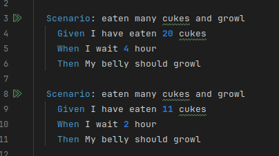
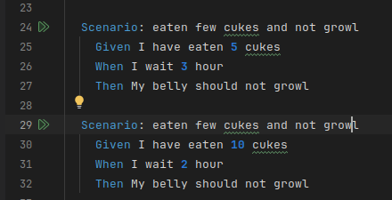
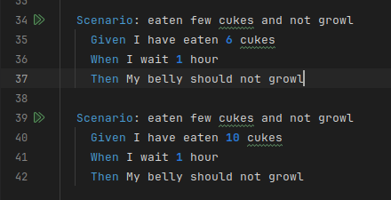
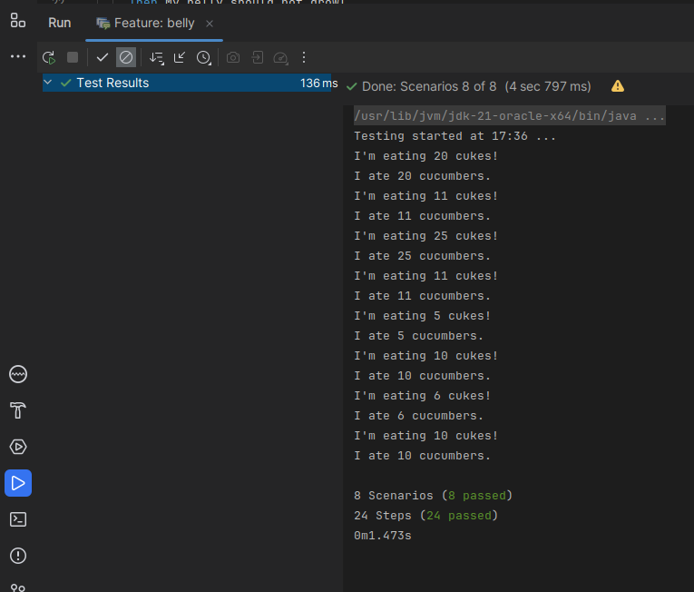

# Actividad Hello Cucumber  
  
Para esta actividad, únicamente se debía escribir sobre el archivo belly.feature  
Teniendo en cuenta la tabla de desición (ubicado en Tabla de desisciones.md) escribiremos código Gherkin respectivo para cada caso y ver si gruñe o no.  
  
    
## Primer caso:  
pepinos > 10, tiempo >=2 , estómago gruñe

Evaluamos cuando son 20 pepinos y y un tiempo de 4 horas, y también en un caso cerca del limite, es decir cuando es 11 pepinos (cerca del 10) con 2 horas de espera (menor tiempo de espera), en ambos casos el estómago debería gruñir.  
  
    
  
    
    
## Seguno caso:  
pepinos > 10, tiempo < 2 , estómago no gruñe
	
 
En ambos casos evaluamos cuando el timepo es 1 hora, y pepinos comidos 25 y 11.  
  
    
    
      
## Tercer caso:  
pepinos <= 10, tiempo >= 2 , estómago no gruñe
 
Primero se evalua para 5 pepinos y 3 horas y luego un caso limite, es decir exactamente 10 pepinos y 2 horas de espera.  
  
  
    
  
        
## Cuarto caso:  
pepinos <= 10, tiempo < 2 , estómago no gruñe
	 
 
En ambos casos evaluamos cuando el timepo es 1 hora, y pepinos comidos 6 y 10 (caso limite).  
  
    
    
      
Resultado al pasar todos los Scenarios:  
  
  
      
## JUAN SILVA        
           

