# Actividad TDD-1  
La actividad consiste en crear un programa que verifique si la letra de entrada coincide con la letra a adivinar, para eso usaremos TDD.  
  
## 1) Creacion de la clase WordTest    

 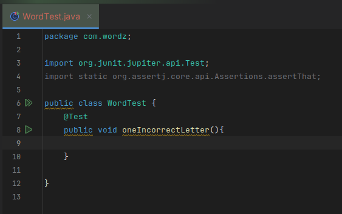  
   
## 2) Llamada de una instancia de la clase Word  
Dicha instancia tendrá como parámetro la Letra a adivinar  
  
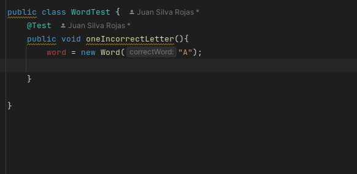  
  
## 3)  Creacion de la clase Word
Con ayuda del editor creaamos esta clase, y le ponemos un nombre del parámetro adecuado (correctWord).  
  
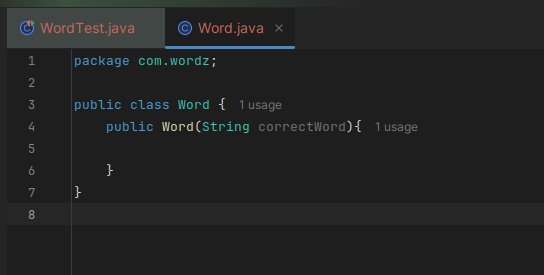  
  
## 4)  Capturar el objeto en una variable local  
Utilizando var nombramos a esta instacia word:  
      
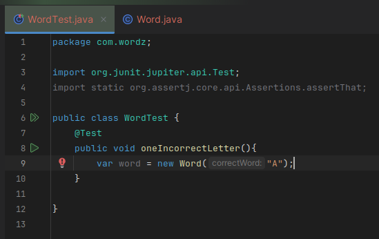  
  
## 5) Llamada del método guess  
Contendrá la palabra de adivinación (la palabra de entrada)  
  
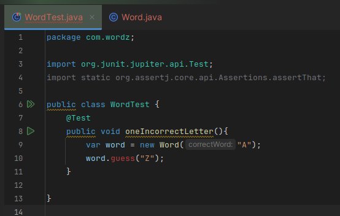  
  
## 6) Creación del método guess  
Con ayuda del editor creamos dicho método en la clase Word, y ponemos un nombre al parámetro adecuado (attempt)  
  
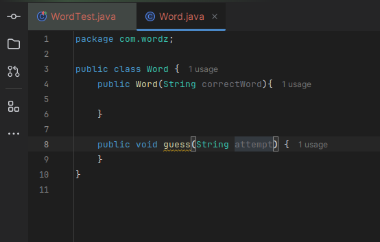  
  
## 7) Agreguemos una forma de obtener la puntuación resultante de esa suposición  
  
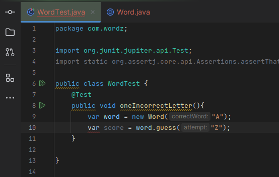  
  
## 8) Pensando en el código de Producción  
Para el código de producción decidimos lo siguiente:  
-Admitir un número variable de letras en una palabra  

-Representar la puntuación mediante una enumeración simple INCORRECT, PART_CORRECT,o CORRECT  

-Acceder a cada puntaje por su posición en la palabra, basado en cero  
  
Entonces procedemos a crear la enumeración Letter que tendrá el INCORRECT, PART_CORRECT,y CORRECT  
  
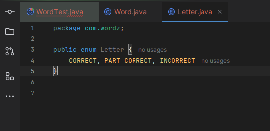  
  
## 9) Capturando esas deiciones en la prueba:  
  
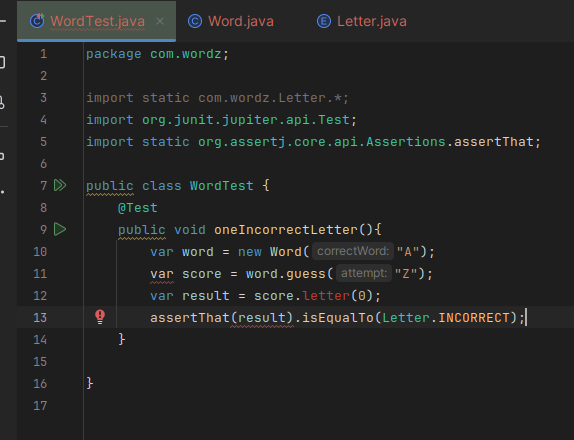  

Aqui si corremos los test vemos que fallan, pero esto no es para alarmarse pues solo se quiere ver si las pruebas están en funcionamiento, parte del trabajo de TDD consiste en eso, en este caso falta añadir código por eso los tests fallan.  
  
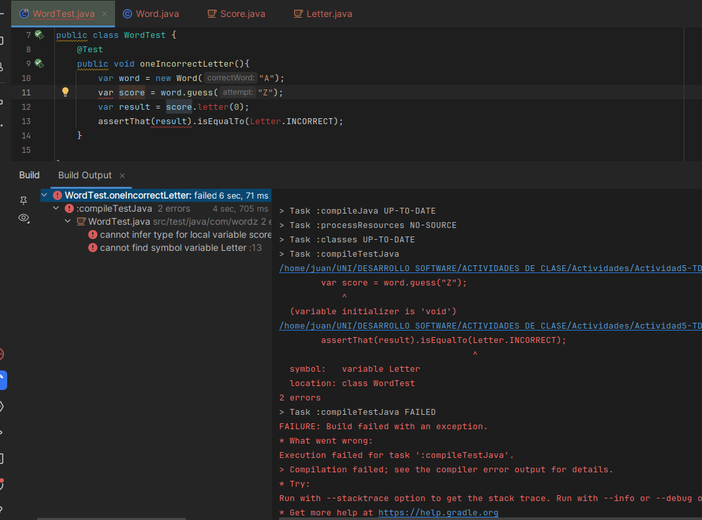  
     
  
## 10) Agregando código a la clase Word  
Especificamente al método guess
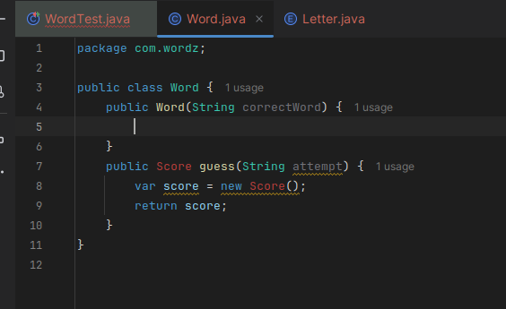  

## 11) Creacion de la clase Score:

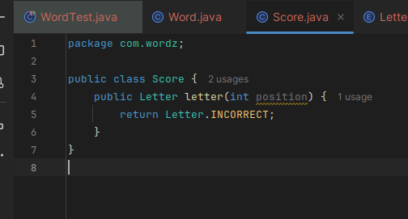  
  
Finalmente se verificia si pasan los test  
  
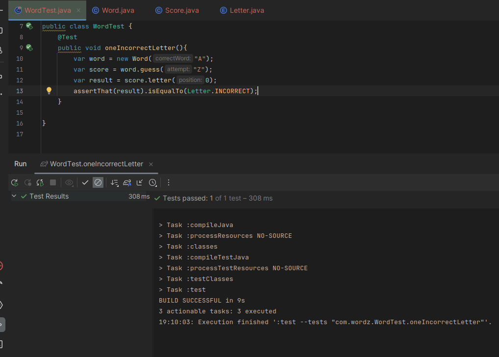  
  
    
    
      
      

