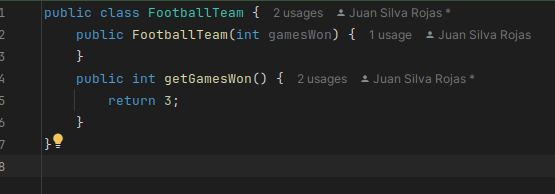
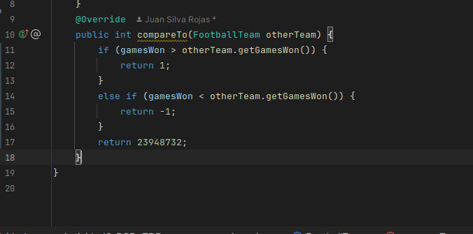
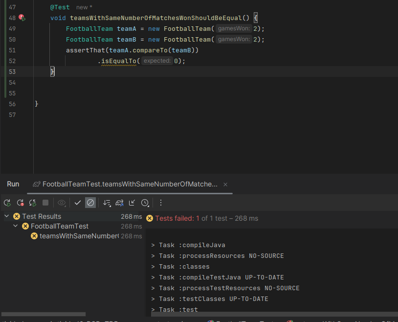
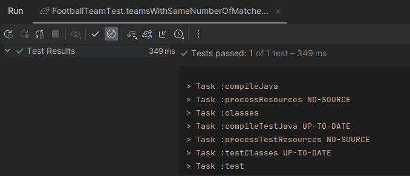
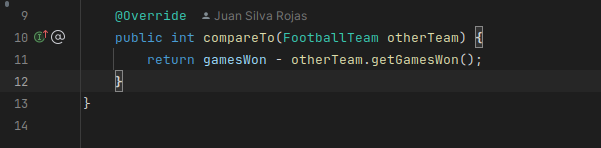

## Actividad RGR-TDD  
  
  
# 1) Comenzamos creando una prueba que falle  
  
    
    
   Obviamente las pruebas, es decir estamos en ROJO  
     
     
    
# 2) Pasamos a verde  
  
    
    
  Las pruebas ahora pasan es decir estamos en VERDE  
    
    
    
      
# 3) Refactorizamos, es decir pasamos a Azul  
  
    
    
   Se debe verificar que en esta refactorizacion las pruebas pasan  
     
    
    
# PRIMER CICLO TDD COMPLETADA  
  
# 1) Volviendo a Rojo  

  
Ahora procedemos a modificar FootballTeamTest añadiendo un test que admite varias parámetros:  
   
     
     
Al hacer eso, ese test va a fallar es decir estamos en ROJO de nuevo  
  
    
    
        
# 2) Pasando a verde  
  
    
    
   Notamos que el test parametrizado pasa, estamos en VERDE  
     
     
     
       
# 3) Refactorizando (pasando a AZUL)  
  
    
    
  Esto dara error pues el constructor de la clase FootballTeam actualmente acepta cualquier valor.La solución es sencilla:  
  
    
    
  Los test con esto cambios si pasan, es decir estamos en AZUL 
    
    
    
# SEGUNDO CICLO COMPLETADO  
  
#¿Pero es comparable?  
El constructor funciona bien. Ahora podemos pasar al problema principal: es decir, compararequipos de fútbol. En primer lugar, hemos decidido que vamos a usar la interfaz java.lang.Comparable  
  
    
  
  
# 1) Volviendo a Rojo  
Si FootballTeam es comparable,
entonces el cliente puede esperar que una vez que haya puesto unos cuantos equipos en una colección, podrá usar el método Collections.sort() para ordenarlos. Si es así, entonces debería haber una prueba para este comportamiento  
  
    
    
 Esta prueba fallará:  
   
     
     
# 2) Pasando a verde:
Creando el metodo compareTo  
  
     
     
    Vemos que los test ahora si pasan:  
      
     
     
# 3) Refactorizando  
En este caso no hay nada que refactorizar asi que automáticamente pasamos a AZUL  
  
# TERCER CICLO TDD COMPLETADO  
  
# 1) Volviendo a Rojo:       
     
Ahora escribamos la primera prueba de comparación. La idea es simple: tomar dos equipos con diferentes números de victorias y compararlos.  
  
    
    
  Las pruebas fallarán, volvemos a ROJO:  
    
    
    
# 2) Pasando a verde  
Hacemos una modiciación en compareTo:  
  
    
    
    
    
# 3) Refactorizando el compareTo y verificando que los test pasen  
  
    
  
  Los test pasan luego de la refactorización entonces estamos en azul  
    
    
    
# CUARTO CICLO TDD COMPLETADO  
  
# 1) Pasando Rojo:  
  
    
    
# 2) Pasando a verde  
  Modificando el metodo compareTo  
    
    
    
  Con esto el test pasará (VERDE)  
    
    
    
  Añadiendo un nuevo test, una prueba de igualdad (este pasará sin problema):  
    
  
    
 Definitivamente hemos omitido un paso en el ritmo TDD. Nunca hemos visto esta prueba de igualdad fallar, así que no sabemos por qué pasa. ¿Por qué?
Para asegurarte de que tu prueba realmente verifica el escenario dado, y que tu código realmente pasa la prueba, necesitas hacer lo siguiente:  

-introduce un cambio en el código de producción que rompería la prueba,  

-ejecuta todas las pruebas y verifica que esta prueba particular falle,  

-revierte el cambio,  

-ejecuta todas las pruebas y verifica que esta prueba particular pase.  
  
  En nuestro caso, el cambio a introducir sería devolver algún otro valor que no sea 0 en la última línea del método compareTo(), por ejemplo:  
  
    
    
   Aqui el test fallará,  
     
   
pero después de revertir la línea para devolver 0 podemos ver que todas nuestras pruebas pasan. Bien, nuestra prueba de igualdad está haciendo lo que debe!  
  
    
    
    
# 3) Refactorizando (AZUL)  
  
    
    
    
    
# JUAN SILVA

    
    
     

   
           
    
   
