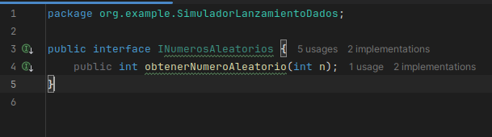
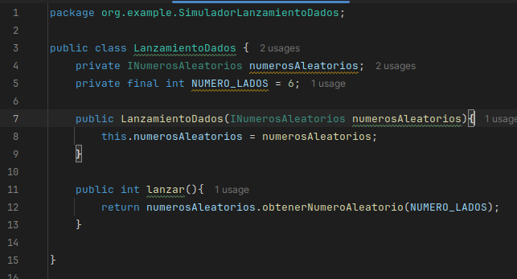
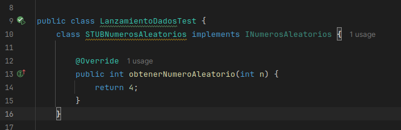
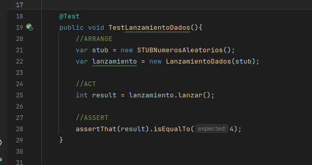
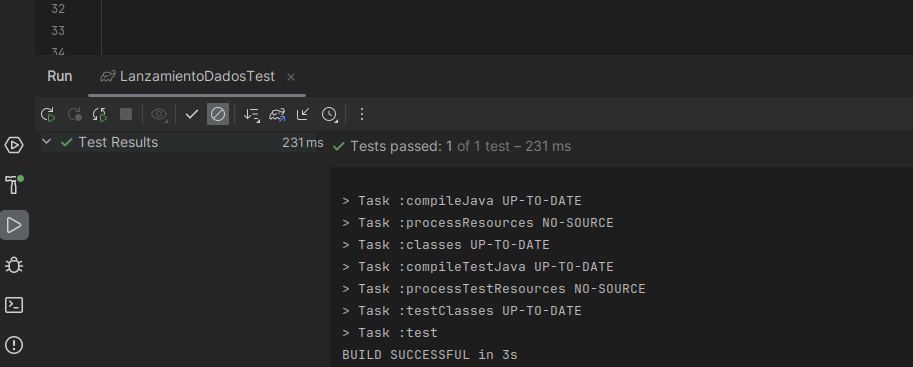
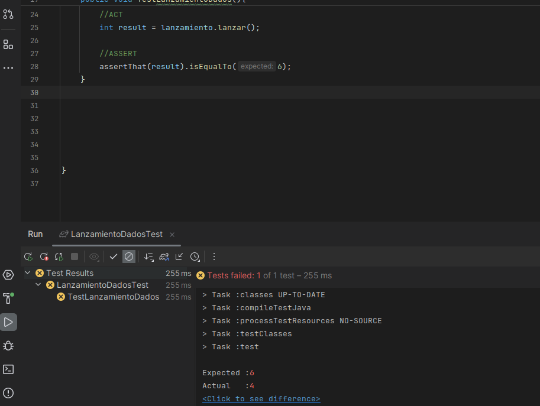
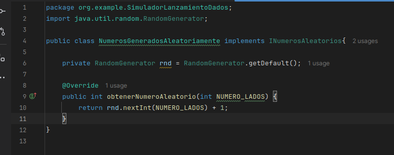
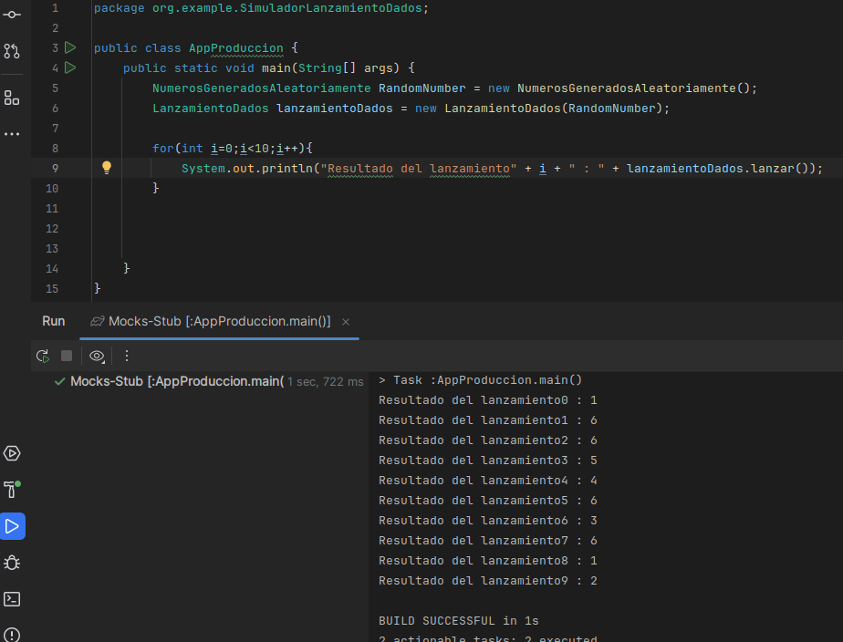

## EJERCICIO 1: Simulador de lanzamiento de dados  

### Paso 1: Crear una interfaz NumerosAleatorios que defina un método para obtener números aleatorios dentro de un rango específico.  
Creamos la interzas llamada `INumerosAleatorios`, la leta "I" al principio hace referencia a
interfaz, el método recibe como parámetro el valor máximo del dado. (que comunmente es de 6)  

  
  
### Paso 2: Modificar la clase LanzamientoDados para que utilice la interfaz NumerosAleatorios, inyectando la dependencia a través del constructor.  
En la linea 7 se inyecta la dependecia pedida mediante un parametro que se pasará al constructor, el método `lanzar()` 
usa un método de dicha dependencia (`obtenerNumeroAleatorio()`) inyectada.  
La clase tiene un atrinuto `NUMERO_LADOS` donde se puede definir el número máximo que se puede obtener del dado (6 lados implica que el número máximo es 6).  

  
  
### Paso 3: Desarrollar un stub de NumerosAleatorios para usar en pruebas unitarias, permitiendo controlar los resultados de los lanzamientos.  
Como se ve en la imágen en la linea 14 estamos establecinedo que el resultado del lanzamiento del dado siempre es 4.
  
  
### Paso 4: Escribir pruebas unitarias para LanzamientoDados utilizando el stub para asegurar que la lógica del lanzamiento funciona como se espera bajo condiciones controladas.  
Usamos el stub creado manualemte y el patrón AAA para la prueba, como se ve en el assert se espera que el resultado siempre sea 4  que es el valor predefinidio en el stub  
    
  
  
Resultado de la prueba
  

Si pusieramos en el assert que el valor esperado es 6 entonces esto nos devolvería un error pues en el stub el resultado está controlado (siempre es 4)  
  
  
### Paso 5: Implementar una clase NumerosGeneradosAleatoriamente que utilice un generador de números aleatorios real y que cumpla con la interfaz NumerosAleatorios  
En esta clase se implementa el método `obtenerNumeroAleatorio` que se usa en la clase `LanzamientoDados` como se vio en el paso 1.
  
  
### Paso 6: Integrar y probar la clase LanzamientoDados en una aplicación de producción, inyectando la implementación real de NumerosAleatorios  
La inyeccion de la implementación real se da en la linea 6 y luego se emula 10 lanzamientos de dados y se muestra la salida en consola.
