## Prueba de Docker Engine  

### Instalar usando apt repository
Antes de instalar Docker Engine por primera vez en una nueva máquina host, debe configurar el repositorio de Docker. Luego, puede instalar y actualizar Docker desde el repositorio.   

1. Configure el repositorio apto de Docker.

```
sudo apt-get update
sudo apt-get install ca-certificates curl
sudo install -m 0755 -d /etc/apt/keyrings
sudo curl -fsSL https://download.docker.com/linux/ubuntu/gpg -o /etc/apt/keyrings/docker.asc
sudo chmod a+r /etc/apt/keyrings/docker.asc

# Add the repository to Apt sources:
echo \
  "deb [arch=$(dpkg --print-architecture) signed-by=/etc/apt/keyrings/docker.asc] https://download.docker.com/linux/ubuntu \
  $(. /etc/os-release && echo "$VERSION_CODENAME") stable" | \
  sudo tee /etc/apt/sources.list.d/docker.list > /dev/null
sudo apt-get update
```

2. Instale los paquetes de Docker. Para instalar la última versión, ejecute:
```
sudo apt-get install docker-ce docker-ce-cli containerd.io docker-buildx-plugin docker-compose-plugin```
```  
  
### Instalar Docker-desktop  
Descarga e instala Docker Desktop: https://docs.docker.com/desktop/install/ubuntu/  
Esto descargará un archivo llamado `docker-desktop-4.30.0-amd64.deb`  
Procedemos a instalarlo usando el comando `sudo dpkg -i docker-desktop-4.30.0-amd64.deb`

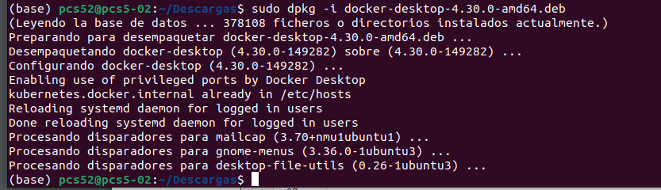  
  
Con esto ya debería estan instalado:  
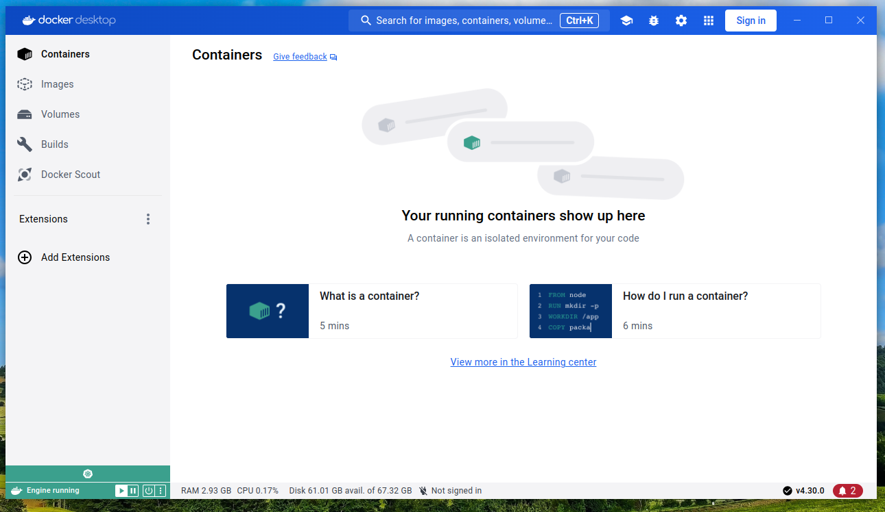  
  
Verificamos la instalación corriendo una imagen de hello-world:
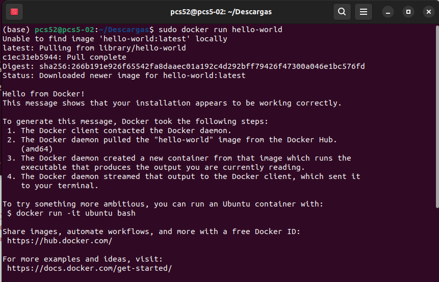
  
Para no estar usando el sudo a la hora de correr una imagen, creamos un grupo docker siguiendo los siguientes comandos:  
1. Crea el grupo docker: `sudo groupadd docker`
2. Agrega tu usuario a tu grupo docker: `sudo usermod -aG docker $USER`  

Ahora probemos correr otra imagen sin sudo: `docker container run rancher/cowsay Hello`
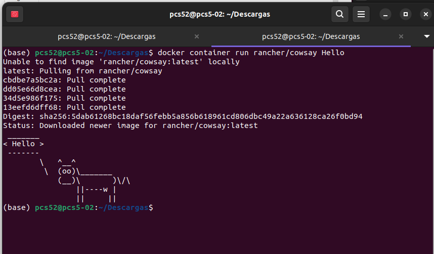  

## Habilitar Kubernetes en Docker Desktop
Docker Desktop viene con soporte integrado para Kubernetes.  
1. Abre el panel de Docker Desktop.
2. En la esquina superior izquierda, selecciona el ícono de la rueda dentada. Esto abrirá la página
   de configuración (setting).
3. En el lado izquierdo, selecciona la pestaña Kubernetes y luego marca la casilla Enable
   Kubernetes
4. Haz clic en el botón Apply & restart.
   Ahora, deberás tener paciencia ya que Docker está descargando toda la infraestructura de soporte y
   luego inicia Kubernetes.
   Una vez que Docker se haya reiniciado, estará listo para usar Kubernetes
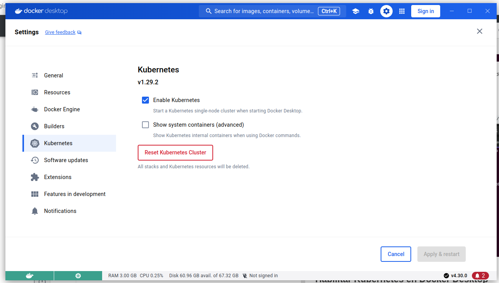  
  
## Probando minikube y kubectl  
### Instalado el minikube  
De la página oficial https://minikube.sigs.k8s.io/docs/start/ nos brinda los comandos de instalación los cuales son:  
```
curl -LO https://storage.googleapis.com/minikube/releases/latest/minikube-linux-amd64
sudo install minikube-linux-amd64 /usr/local/bin/minikube && rm minikube-linux-amd64
```  
  
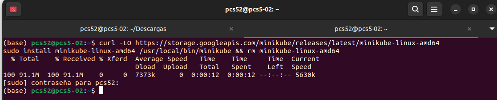  
  
### Instalando el kubetctl  
De la documentación oficial kubectl https://kubernetes.io/docs/tasks/tools/install-kubectl-linux/ nos brinda los siguientes comandos de instalación:  
1. Descargue la última versión con el comando:
```
curl -LO "https://dl.k8s.io/release/$(curl -L -s https://dl.k8s.io/release/stable.txt)/bin/linux/amd64/kubectl"
```  
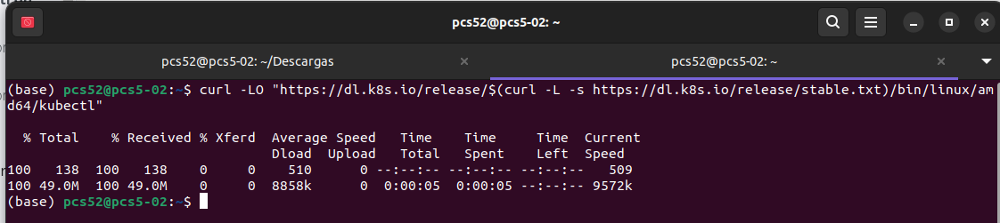
2. Valide el binario (opcional). Descargue el archivo de suma de comprobación kubectl:  
```
curl -LO "https://dl.k8s.io/release/$(curl -L -s https://dl.k8s.io/release/stable.txt)/bin/linux/amd64/kubectl.sha256"
echo "$(cat kubectl.sha256)  kubectl" | sha256sum --check  
```  
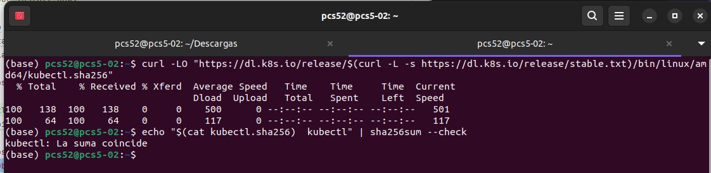  
  
3. Install kubectl:  
```
sudo install -o root -g root -m 0755 kubectl /usr/local/bin/kubectl
```  
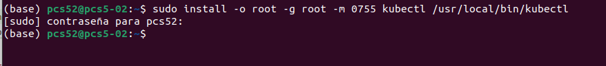  

Ahora escribe minikube start para iniciar el cluster por defecto . La primera vez que hagas esto, llevará
un tiempo ya que minikube necesita descargar todos los binarios de Kubernetes. Cuando termine, la
última línea del resultado en su pantalla debería ser algo como esto:  
  
```
   minikube start
```
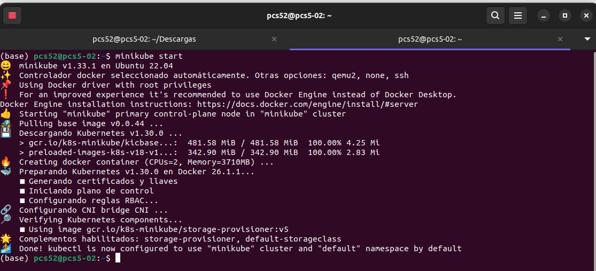  

Empecemos. Sigue estos pasos cuidadosamente:
1. Intenta acceder al clúster usando kubectl. Primero, debes asegurarte de tener seleccionado el
   contexto correcto para kubectl. Si anteriormente instalastes Docker Desktop y ahora minikube, puedes
   usar el siguiente comando:  
``kubectl config get-contexts``  

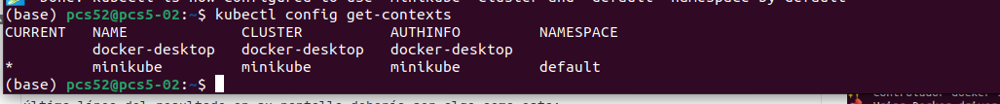  

El asterisco al lado del contexto llamado minikube te dice que este es el contexto actual. Así, al usar
kubectl, se trabajará con el nuevo cluster creado por minikube.
2. Ahora veamos cuántos nodos tiene tu cluster con este comando:  
``kubectl get nodes``  

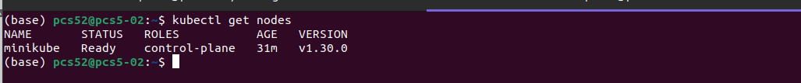  

Deberías obtener algo similar a esto. Ten en cuenta que la versión mostrada podría diferir en tu caso:  

• Aquí tenemos un clúster de un solo nodo. El papel del nodo es el de plano de control, lo que
significa que es un nodo maestro. Un clúster de Kubernetes típico consta de unos pocos nodos
maestros y muchos nodos trabajadores.  

La versión de Kubernetes con la que estamos trabajando aquí es la v1.30.0.  

3. Ahora, intenta ejecutar algo en este clúster. Usaremos Nginx, un servidor web popular para esto.
   Utiliza el archivo .yaml, que acompaña a la actividad que vas a utilizar para esta prueba:
   Abre una nueva ventana de Terminal y crea un pod que ejecute Nginx con el siguiente comando:  

   `` kubectl apply -f nginx.yaml ``  


