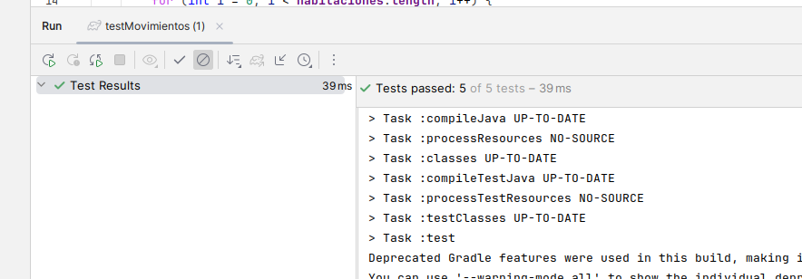

# Sprint 1  
### Lógica del juego:  
Tenemos 5 habitaciones ordenados en una columna de los cuales comenzamos en la habitacion 0 como se muetsra en la imagen, solo esta
permitido moverse hacia arria (mover norte) y hacia abajo (mover sur).

  
Para los testing debemos testear que el juego no admite movimientos invalidos y si admite movimientos validos:  

Estos dos primeros tests verifican el caso de movimiento sur, primero para el caso en que no se puede bajar mas (donde derberia lanzar una excepcion)
y el segundo caso cuando en un movimiento sur valido
  
  
La misma lógica de los testing del sur se aplica tambien para los dos primeros tests pero para el norte  
El ultimo test (linea 62) verifica que solo se admita comandos validos para los movimientos
  
  
Como solo son 5 habitaciones enumeradas del 0 al 4, en la creación del jugador la habitacion actual no puede ser
una habitacion fuera de ese rango, en el test se verifica que el código no admita una habitacion -1.
  

Entonces para cumplir con los tests, en la codificacion del juego, se definen 5 habitaciones (linea 8) y la habitacion inicial es la habiacion 0   
Por consola se solicita el movimiento (solo valido `mover norte` y `mover sur`), y se llama al metodo
`mover()` para efecutar el camvbio de habitacion actual

Dado que son 5 habitaciones entonces el id no debe exceder de 5 y además no hay habitaciones negativas, caso contrario
seria una habitacion no valida, esto se evalua en el constructor

La clase jugador tiene el método `mover()` dicho metodo solo admite los movimientos validos mencionados anteriormente
si por ejemplo estamos en la primera habitacion y queremos retroceder(accion invalida porque no hay mas habitaciones atras)
entonces debería lanzar una excepcion eso se ve en la condicional de la linea 32, la misma lógica cuando estamos
en la ultima habitacion y queremos subir mas (condicional de la linea 29)

Salida:   
Al realizar un movimiento el programa termina ejecución, eso de corregirá en el siguiente sprint

Resultado de los tests si cumplen con todo:  
Test de la creacion de habitaciones  
    
  
Tests de los movimientos del juego
  
  
# Sprint 2  
  
Añadimos los atributos `acertijo` que contiene el acertijo de la habitación respectiva  
También tiene el atributo `respuesta` que contiene la respuesta respectiva del acertijo  
Y un atributo `completado` que nos indica si el acertijo de la habitación ha sido resolvido 

  
    
En el juego desde la linea 16 a la 20 es añadir los acertijos con tu respuesta respectiva a cada habitacion  
Se añadió un bucle (linea 32) para que el juego no se acabe con el primero movimiento, si no que se acabe cuando se haya completado todos los acertijos,
para ello usamos la variable `flag` que nos indica si el acertijo se resolvio o no, si todos los acertijos han sido resueltos entonces flag siempre sera true por lo tanto sale del bucle.
