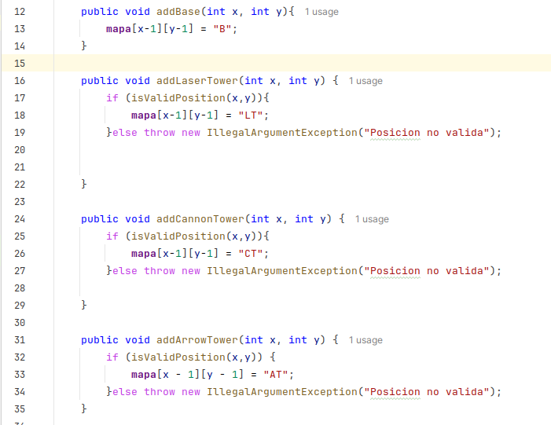
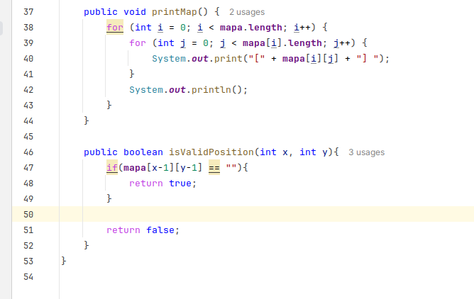
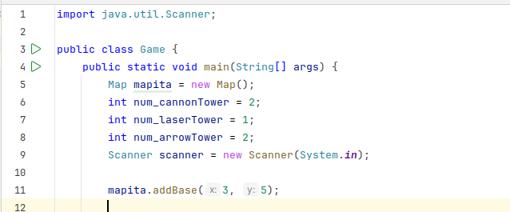
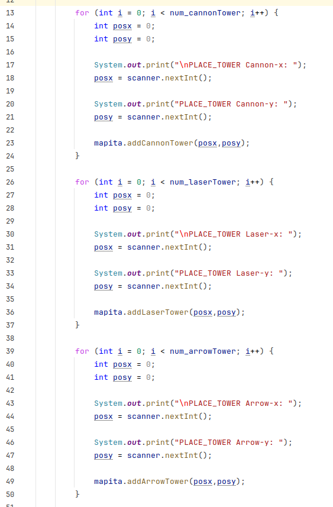

## Clase Mapa
Creamos una clase `Map` que inicializa el mapa de dimensión 5 con celdas vacias 

  

Dentro de esta clase tenemos las funciones de añadir torres y la base:  
* Representacion de la base: B
* Representacion de la torre laser: LT  
* Representacion de la torre cañon: CT
* Representacion de la torre Flecha: AT

  
  

Tambien contiene metodos para printear el mapa y para verificar si la posicion es valida,
esta función verifica si es posible colocar una torre en una celda
  
    
## Clase Game  
Aqui instanciamos el mapa y definimos la cantidad de torres que tendremos de cada tipo  
Ademas definimos la posicion de la base  

  
  
En esta secuencia de bucles for es para pedir al usuario las posiciones de las torres de cada tipo  

